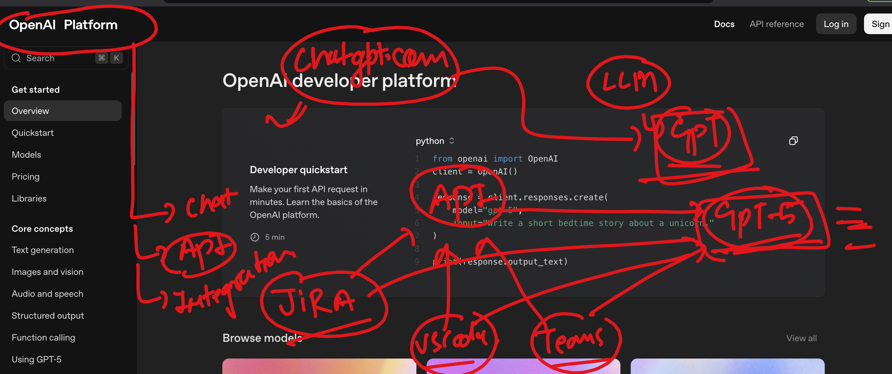

# walmart_GENAI_TPMs_20thaug2025

### Basic of ML and AI 

### AI & GENAI 

## ML vs AI vs GenAI 

## prompting in GenAI options 

### type of prompting there 

### OpenAI models can be accessed by platform  --using chat / API / integrations

### walmart sales forecasting using no-code genai/tools 

### forecasting understanding 

