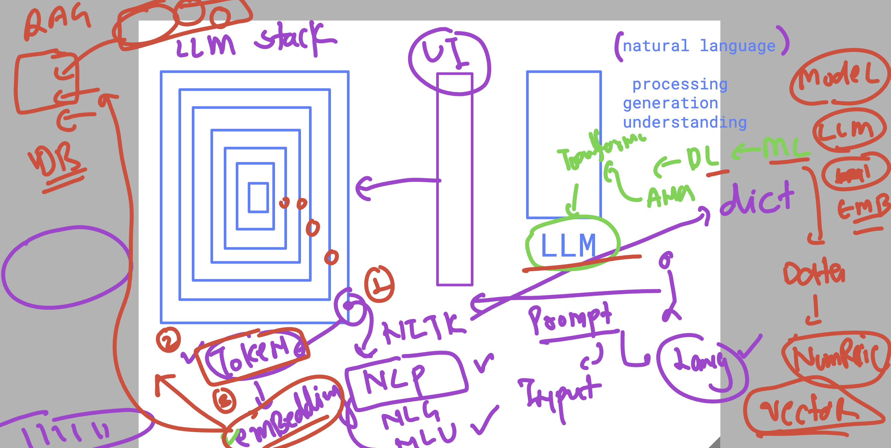
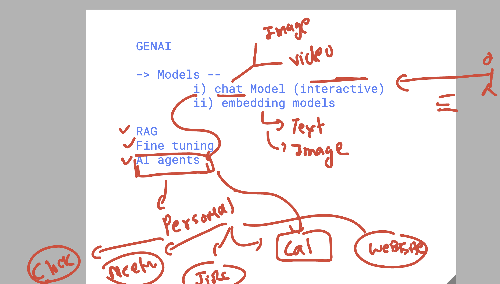

# walmart_GENAI_TPMs_20thaug2025

### Revision for LLM (chatmodel + embedding model)



### GENAI in overall context 



## Prepare Sample project description 

```
1. Set up hardware racks before installing the OS.
2. Install OS before deploying middleware.
3. Middleware must be ready before application deployment.
4. Vendor must deliver networking gear before rack setup.
5. QA testing starts only after application deployment.

```

# can use copilot -- prompt  (tasks for prompting)