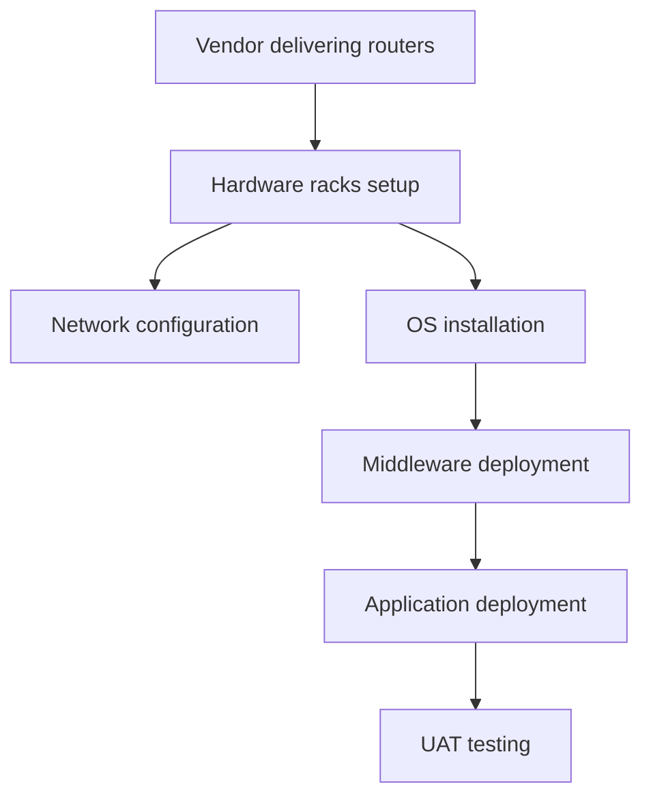

```mermaid
graph TD
    Vendor_Routers["Vendor delivering routers"]
    Rack_Setup["Hardware racks setup"]
    Network_Config["Network configuration"]
    OS_Install["OS installation"]
    Middleware["Middleware deployment"]
    App_Deploy["Application deployment"]
    UAT_Testing["UAT testing"]

    Vendor_Routers --> Rack_Setup
    Rack_Setup --> OS_Install
    OS_Install --> Middleware
    Middleware --> App_Deploy
    App_Deploy --> UAT_Testing
    Rack_Setup --> Network_Config
```
